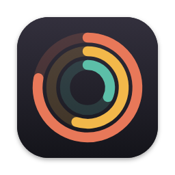
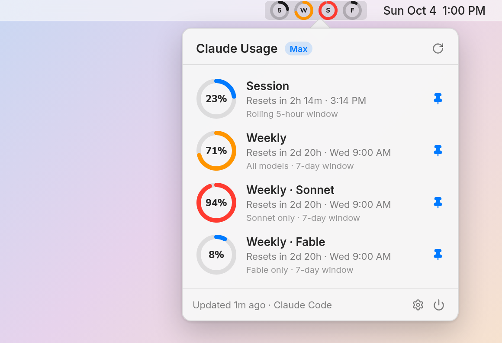
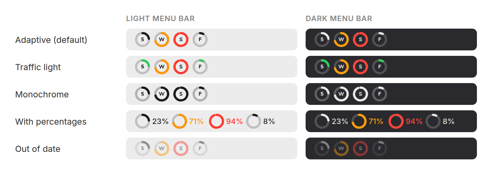

<p align="center">
  
</p>

<h1 align="center">Claude Usage</h1>

<p align="center">
  Your Claude plan limits as circular meters in the macOS menu bar.
</p>

<p align="center">
  
  
  <a href="LICENSE"></a>
</p>

<p align="center">
  <picture>
    <source media="(prefers-color-scheme: dark)" srcset="docs/images/hero-dark.png">
    
  </picture>
</p>

Claude Usage puts one small ring in your menu bar for each of your Claude plan's limits. Each ring fills as you use that limit up, so you can see at a glance how close you are before you hit one.

- **5**: the rolling 5-hour session limit
- **W**: the weekly limit across all models
- **S**, **O**, **F**, …: per-model weekly limits (Sonnet, Opus, Fable, …). These appear once you start using them.

These are the same numbers shown by `/usage` in Claude Code and on **claude.ai › Settings › Usage**. The limits are shared between claude.ai, the Claude apps and Claude Code, so the rings show your usage across all of them.

## Features

- **At-a-glance rings.** They turn orange at 70% and red at 90%.
- **Details on click.** The panel shows exact percentages and when each limit resets. Pin or unpin any limit to choose which rings stay in the menu bar.
- **Zero setup if you use Claude Code.** The app reads the sign-in Claude Code already keeps in your Keychain. It never changes or refreshes that token.
- **Works without Claude Code too.** Paste a claude.ai session cookie instead.
- **Light and dark menu bars.** Three color styles, optional percentages, and labels inside the rings.
- **Polite polling.** It refreshes every 5 minutes by default and backs off when Claude rate-limits. It also refreshes right after a limit resets and fades the rings when the data is out of date.
- **Tiny and private.** It's a native AppKit/SwiftUI app with no dependencies, no analytics and no Dock icon.

## Install

You'll need macOS 13 Ventura or later, and Xcode 15+ or the Xcode Command Line Tools (Swift 5.9+).

```sh
git clone https://github.com/mihok/osx-claude-usage.git
cd osx-claude-usage
make install
```

`make install` builds **Claude Usage.app**, copies it to `/Applications` (or `~/Applications`) and starts it. The rings appear in your menu bar right away. To keep them there after a restart, open **Settings…** and turn on **Launch at login**.

To update, `git pull` and run `make install` again.

## Using it

| Action | What happens |
| --- | --- |
| Click the rings | Opens the details panel |
| Right-click the rings | Refresh Now, Settings…, Quit |
| Click a 📌 pin in the panel | Shows or hides that limit's ring in the menu bar |
| Hover over the rings | A tooltip lists every limit and its reset time |

### Menu bar styles

Choose a style in **Settings › Menu bar**. You can also replace the labels inside the rings with percentages next to them.

<p align="center">
  
</p>

## Where the numbers come from

Pick a source in **Settings › Data source**.

### Claude Code sign-in (default)

If you've signed in to [Claude Code](https://claude.com/claude-code) with your Claude account, nothing else is needed. The app reads that sign-in from the macOS Keychain (`Claude Code-credentials`) and asks Claude for your usage, the same way `/usage` does.

- The token is **only read**. The app never refreshes, rewrites or copies it.
- macOS may ask once whether Claude Usage can read the Keychain item. Choose **Always Allow**.
- Claude Code renews its sign-in whenever you use it. If you haven't used it for a while, the sign-in can expire. The app will tell you to run any `claude` command, then carry on automatically.

### claude.ai browser session

Use this if you don't use Claude Code, or if the Claude Code source keeps getting rate-limited.

1. Open <https://claude.ai/settings/usage> in your browser.
2. Open Developer Tools › Network, reload the page and select the `usage` request.
3. Copy its **Cookie** request header, or just the `sessionKey` value, and paste it into Settings.

The cookie is stored in your login Keychain and sent only to `claude.ai`. Treat it like a password: anyone with it can use your claude.ai account.

## Privacy and security

- The app only talks to `api.anthropic.com` (Claude Code source) or `claude.ai` (browser session source). It has no analytics, telemetry or update checks.
- Credentials stay in the macOS Keychain. They're never written to preferences, logs or other files.
- The source is small and readable. Start with [`UsageClient.swift`](Sources/ClaudeUsageCore/UsageClient.swift) to see every request the app makes.

## Troubleshooting

**"No Claude Code sign-in found"**
Run `claude` in Terminal and sign in with your Claude account. Or switch to the claude.ai browser session source.

**"Your Claude Code sign-in has expired"**
Run any `claude` command. Claude Code renews the sign-in, and the rings update within a minute.

**"Claude is rate-limiting usage requests"**
Claude limits how often usage can be checked. The app keeps showing the last known values and retries with a growing delay. If it keeps happening, set a longer refresh interval or use the claude.ai source.

**"Claude rejected the credentials" with the claude.ai source**
Your browser session has expired or been signed out. Copy a fresh cookie into Settings.

**macOS says the app can't be opened**
This only happens with a copy you downloaded rather than built yourself. Right-click the app, choose **Open**, or run `xattr -dr com.apple.quarantine "/Applications/Claude Usage.app"`.

## Development

```sh
make build     # swift build (debug)
make test      # unit tests (needs full Xcode for XCTest)
make app       # build/Claude Usage.app, release, ad-hoc signed
make run       # build and launch the .app
make preview   # render the rings, panel, settings and icon with sample data to build/preview
```

You can also open the folder in Xcode (`xed .`), pick the **ClaudeUsage** scheme and press ⌘R.

```
Sources/ClaudeUsageCore/   Response parsing, credentials, formatting, refresh scheduling (unit-tested, Foundation only)
Sources/ClaudeUsage/       The app: status item, ring renderer, details panel, settings
Tests/                     XCTest suite for ClaudeUsageCore
Packaging/Info.plist       App bundle metadata (menu bar only, no Dock icon)
scripts/                   build-app.sh (assemble, render icon, sign) and install.sh
```

To build a universal (Apple silicon + Intel) binary, run `UNIVERSAL=1 make app`. To distribute a signed copy, set `CODESIGN_IDENTITY` to your Developer ID.

## Caveats

- Both usage endpoints are internal to Claude's own apps rather than a published API. They can change or rate-limit without notice, and if they change, the rings may stop updating until the app is fixed.
- Not affiliated with or endorsed by Anthropic. Claude is a trademark of Anthropic, PBC.

## License

[MIT](LICENSE)
